# Multi-pedestrian interaction with automated vehicle
Framework for the analysis of crossing behaviour in the interaction between multiple pedestrians and an automated vehicle, from the perspective of one of the pedestrians using a crowdsourcing approach.

## Setup
Tested with Python 3.9.11. To setup the environment run these two commands in a parent folder of the downloaded repository (replace `/` with `\` and possibly add `--user` if on Windows):

**Step 1:**  

Clone the repository
```command line
git clone https://github.com/bazilinskyy/multiped.git
```

**Step 2:** 

Install Dependencies
```command line
pip install -r requirements.txt
```

**Step 3:**

Ensure you have the required datasets in the data/ directory.

**Step 4:**

Run the code:
```command line
python3 analysis.py
```


## Results

Demographic Distribution of the participants
[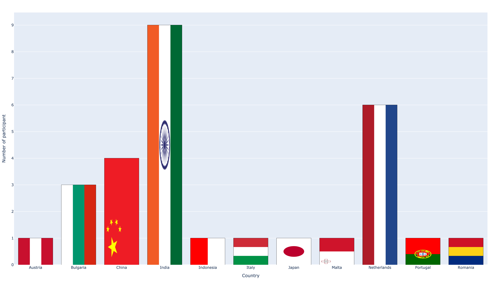](https://htmlpreview.github.io/?https://github.com/bazilinskyy/multiped/blob/main/figures/demographic.html)

Age Distribution of the participants
[](https://htmlpreview.github.io/?https://github.com/bazilinskyy/multiped/blob/main/figures/age.html)

Gender Distribution of the participants
[](https://htmlpreview.github.io/?https://github.com/bazilinskyy/multiped/blob/main/figures/gender.html)

Trigger press when car is yielding, the other pedestrian is in front and car has no eHMI
[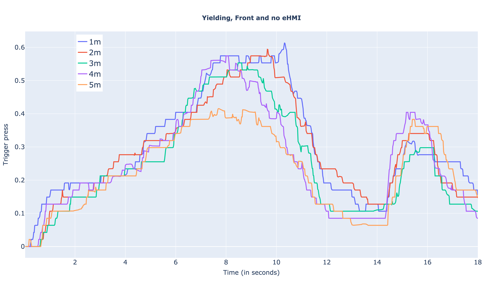](https://htmlpreview.github.io/?https://github.com/bazilinskyy/multiped/blob/main/figures/group_1_trigger.html)

Trigger press when car is yielding, the other pedestrian is in back and car has no eHMI
[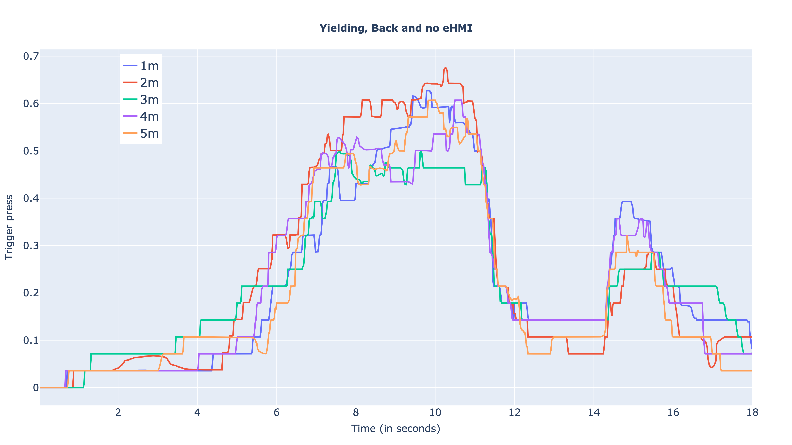](https://htmlpreview.github.io/?https://github.com/bazilinskyy/multiped/blob/main/figures/group_2_trigger.html)

Trigger press when car is yielding, the other pedestrian is in front and car has eHMI
[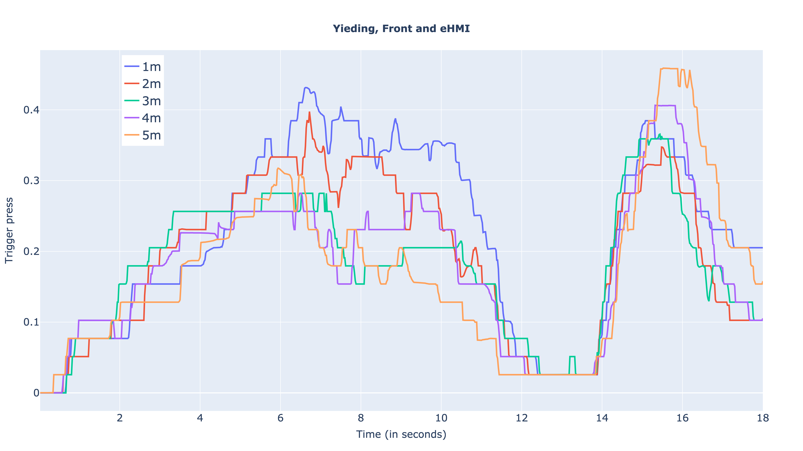](https://htmlpreview.github.io/?https://github.com/bazilinskyy/multiped/blob/main/figures/group_3_trigger.html)

Trigger press when car is yielding, the other pedestrian is in back and car has eHMI
[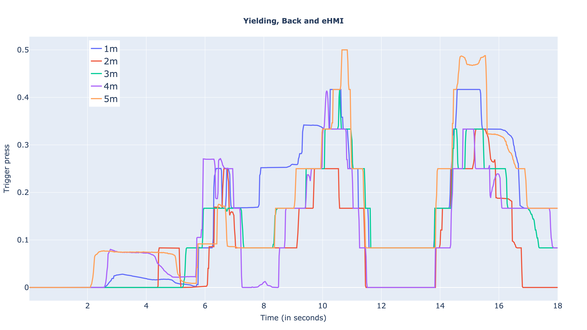](https://htmlpreview.github.io/?https://github.com/bazilinskyy/multiped/blob/main/figures/group_4_trigger.html)

Trigger press when car is not yielding, the other pedestrian is in front and car has eHMI
[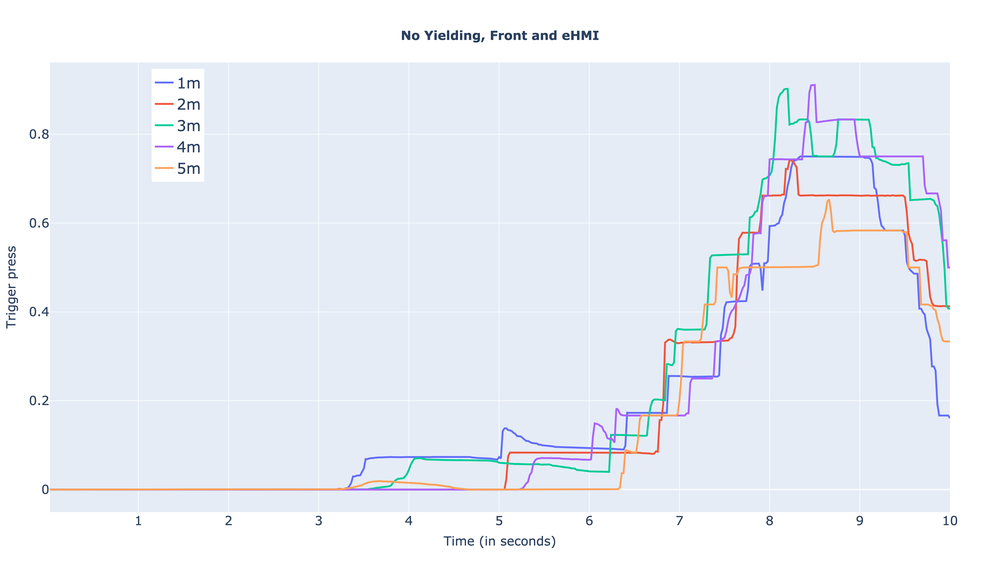](https://htmlpreview.github.io/?https://github.com/bazilinskyy/multiped/blob/main/figures/group_5_trigger.html)

Trigger press when car is not yielding, the other pedestrian is in back and car has eHMI
[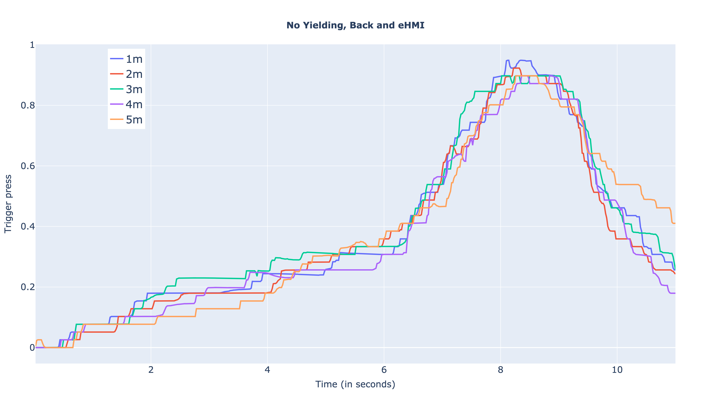](https://htmlpreview.github.io/?https://github.com/bazilinskyy/multiped/blob/main/figures/group_6_trigger.html)

Trigger press when car is not yielding, the other pedestrian is in front and car has no eHMI
[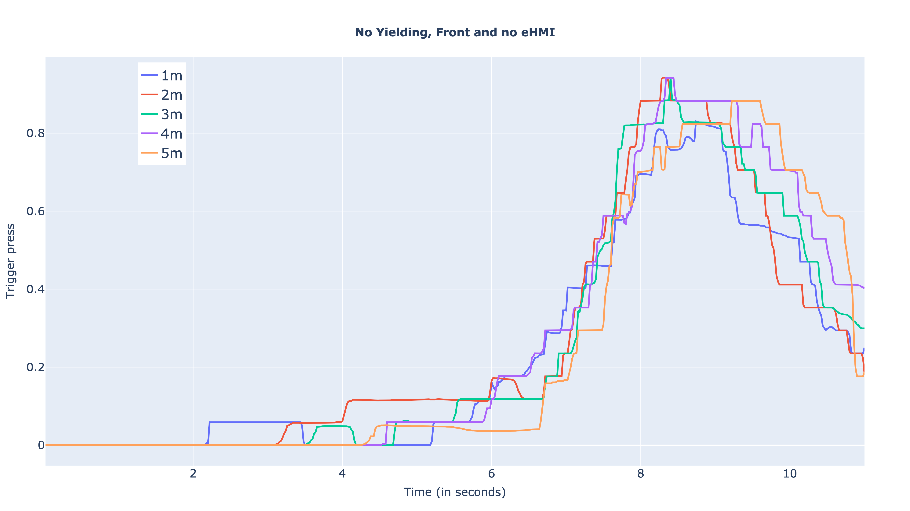](https://htmlpreview.github.io/?https://github.com/bazilinskyy/multiped/blob/main/figures/group_7_trigger.html)

Trigger press when car is not yielding, the other pedestrian is in back and car has no eHMI
[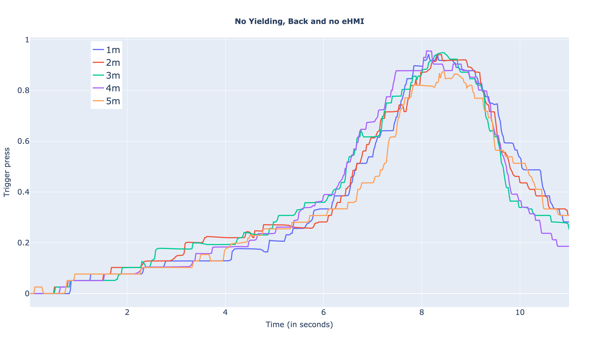](https://htmlpreview.github.io/?https://github.com/bazilinskyy/multiped/blob/main/figures/group_8_trigger.html)


Yaw angle when car is yielding, the other pedestrian is in front and car has no eHMI
[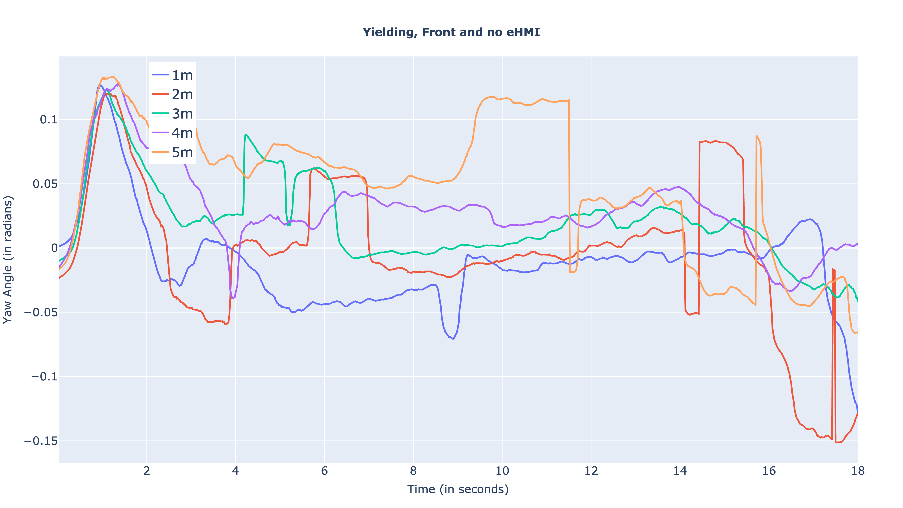](https://htmlpreview.github.io/?https://github.com/bazilinskyy/multiped/blob/main/figures/yaw_group_1.html)

Yaw angle when car is yielding, the other pedestrian is in back and car has no eHMI
[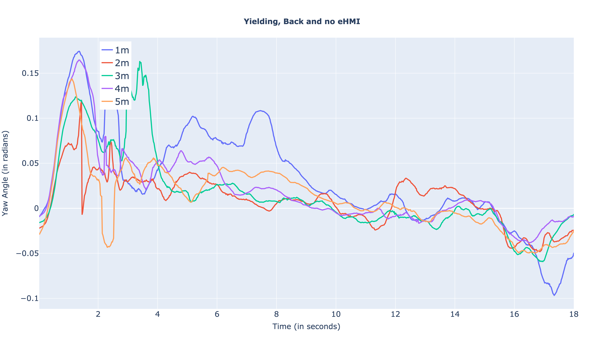](https://htmlpreview.github.io/?https://github.com/bazilinskyy/multiped/blob/main/figures/yaw_group_2.html)

Yaw angle when car is yielding, the other pedestrian is in front and car has eHMI
[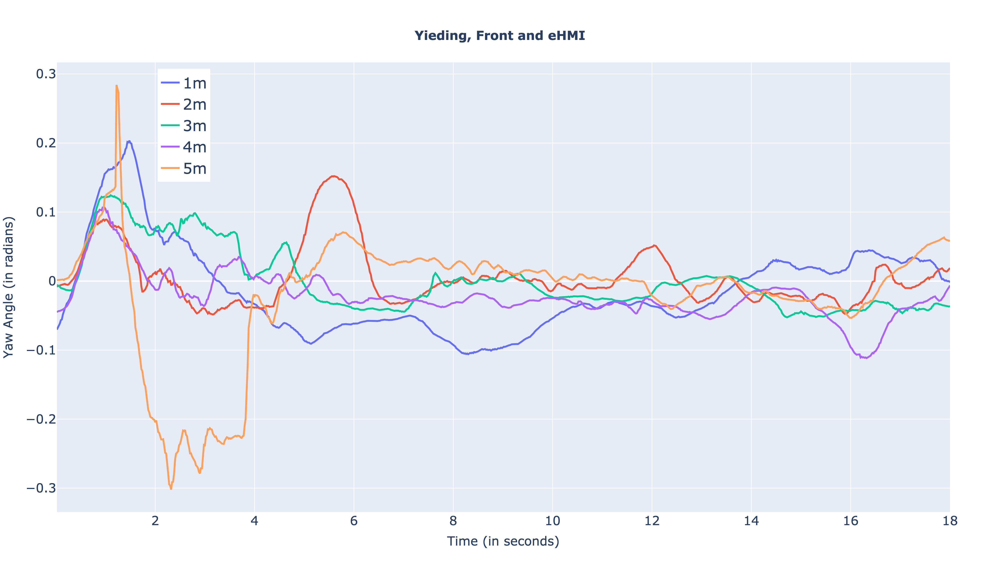](https://htmlpreview.github.io/?https://github.com/bazilinskyy/multiped/blob/main/figures/yaw_group_3.html)

Yaw angle when car is yielding, the other pedestrian is in back and car has eHMI
[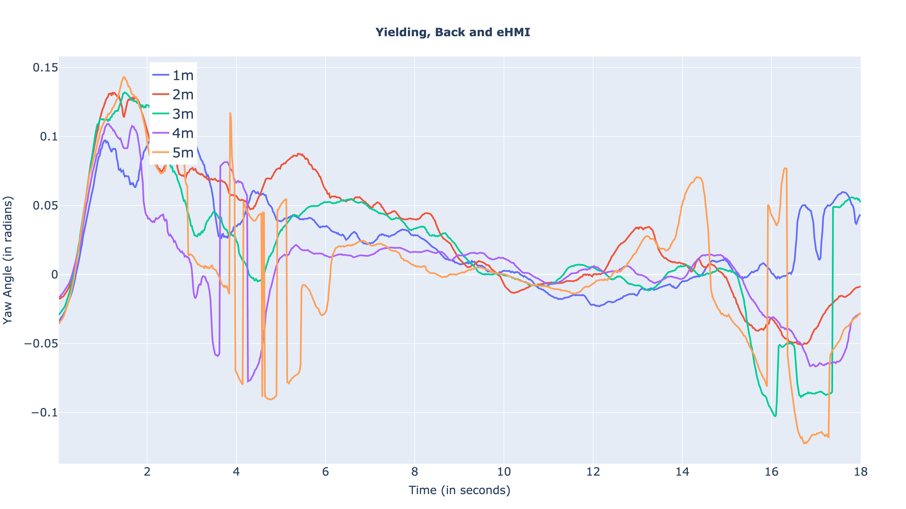](https://htmlpreview.github.io/?https://github.com/bazilinskyy/multiped/blob/main/figures/yaw_group_4.html)

Yaw angle when car is not yielding, the other pedestrian is in front and car has eHMI
[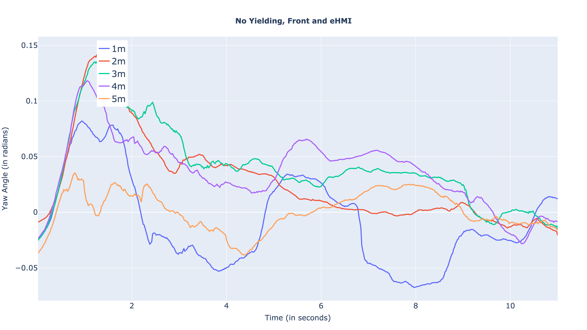](https://htmlpreview.github.io/?https://github.com/bazilinskyy/multiped/blob/main/figures/yaw_group_5.html)

Yaw angle when car is not yielding, the other pedestrian is in back and car has eHMI
[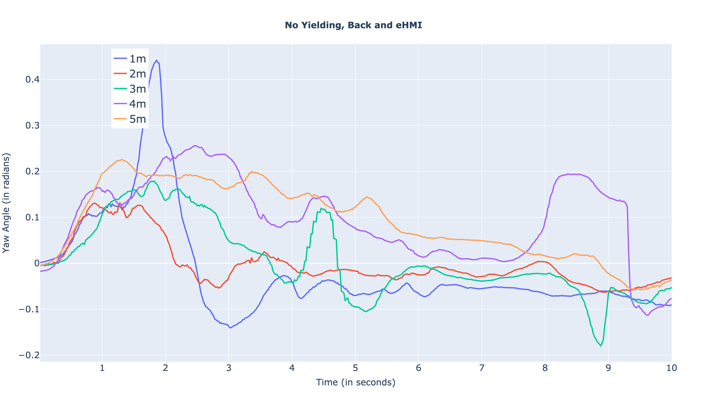](https://htmlpreview.github.io/?https://github.com/bazilinskyy/multiped/blob/main/figures/yaw_group_6.html)

Yaw angle when car is not yielding, the other pedestrian is in front and car has no eHMI
[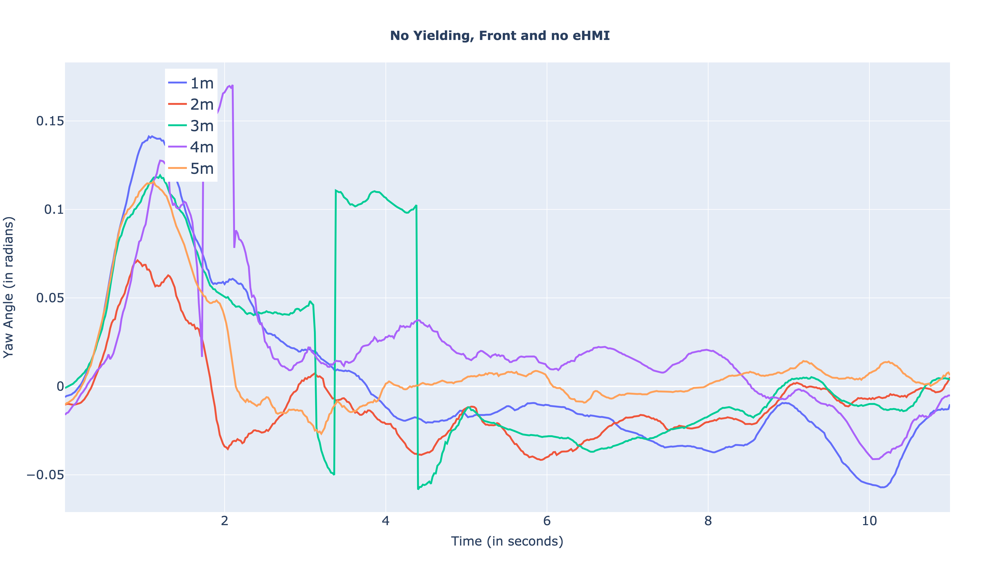](https://htmlpreview.github.io/?https://github.com/bazilinskyy/multiped/blob/main/figures/yaw_group_7.html)

Yaw angle when car is not yielding, the other pedestrian is in back and car has no eHMI
[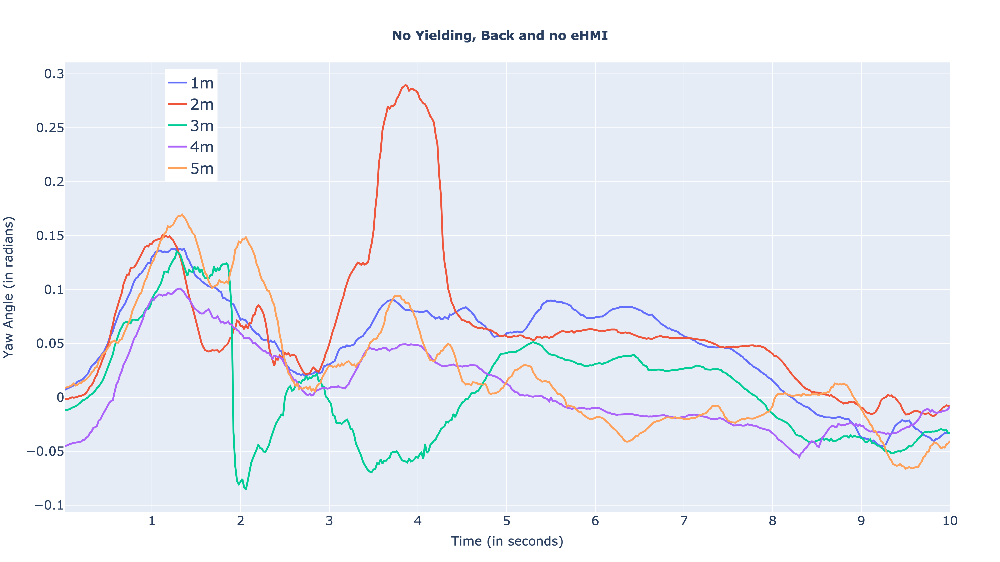](https://htmlpreview.github.io/?https://github.com/bazilinskyy/multiped/blob/main/figures/yaw_group_8.html)

## Troubleshooting
### Troubleshooting setup
#### ERROR: multiped is not a valid editable requirement
Check that you are indeed in the parent folder for running command `pip install -e multiped`. This command will not work from inside of the folder containing the repo.


## Contact
If you have any questions or suggestions, feel free to reach out to md_shadab_alam@outlook.com
