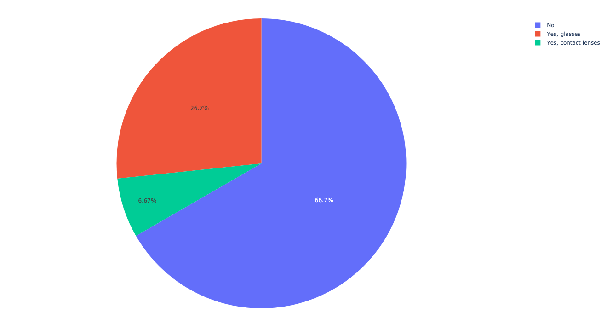
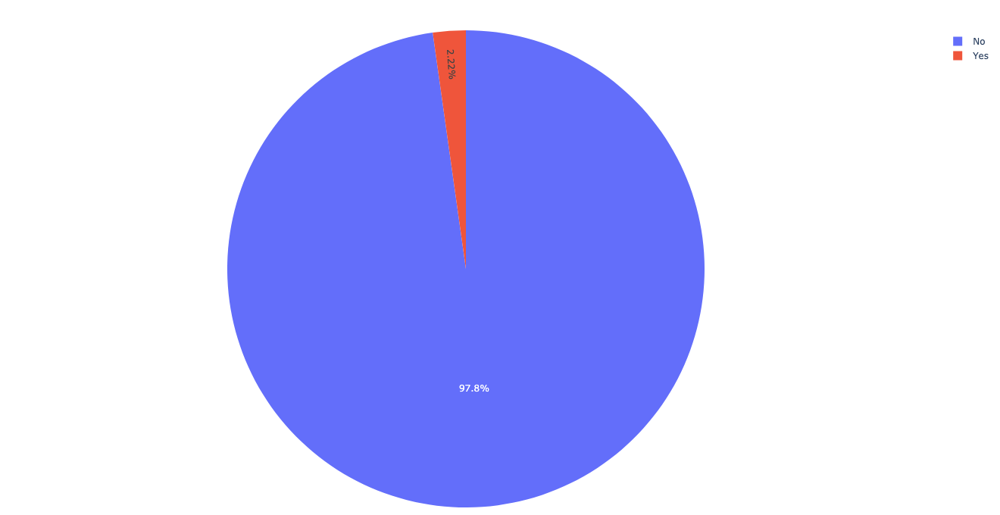
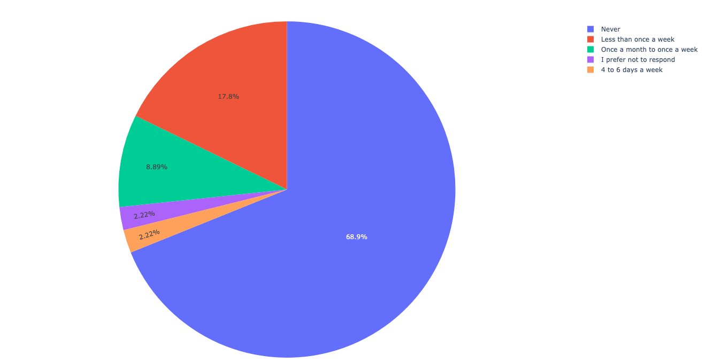
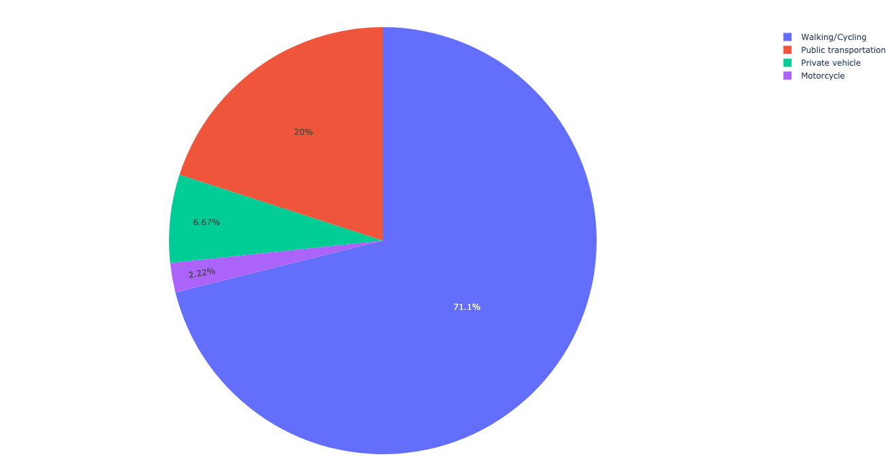
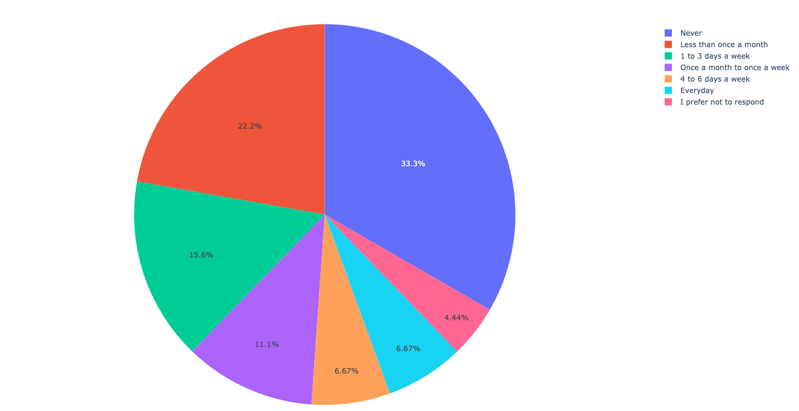
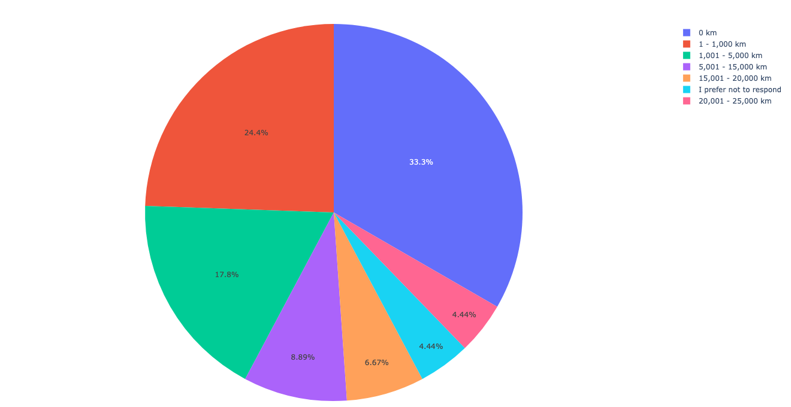
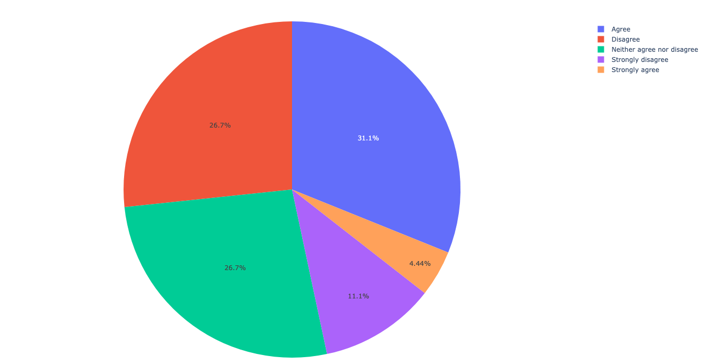
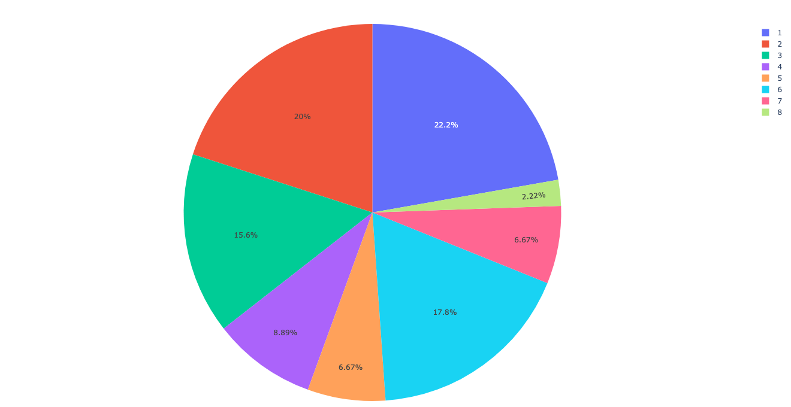
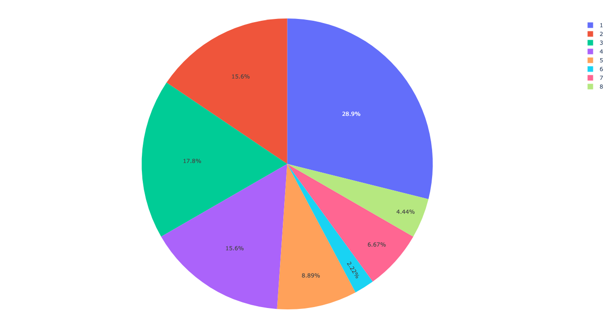

# Multi-pedestrian interaction with automated vehicle
Framework for the analysis of crossing behaviour in the interaction between multiple pedestrians and an automated vehicle, from the perspective of one of the pedestrians using a crowdsourcing approach.


## Getting started
[](https://www.python.org/downloads/release/python-3919/)
[](https://docs.astral.sh/uv/)

Tested with **Python 3.9.11** and the [`uv`](https://docs.astral.sh/uv/) package manager.  
Follow these steps to set up the project.

**Step 1:** Install `uv`. `uv` is a fast Python package and environment manager. Install it using one of the following methods:

**macOS / Linux (bash/zsh):**
```bash
curl -LsSf https://astral.sh/uv/install.sh | sh
```

**Windows (PowerShell):**
```powershell
irm https://astral.sh/uv/install.ps1 | iex
```

**Alternative (if you already have Python and pip):**
```bash
pip install uv
```

**Step 2:** Fix permissions (if needed):t

Sometimes `uv` needs to create a folder under `~/.local/share/uv/python` (macOS/Linux) or `%LOCALAPPDATA%\uv\python` (Windows).  
If this folder was created by another tool (e.g. `sudo`), you may see an error like:
```lua
error: failed to create directory ... Permission denied (os error 13)
```

To fix it, ensure you own the directory:

### macOS / Linux
```bash
mkdir -p ~/.local/share/uv
chown -R "$(id -un)":"$(id -gn)" ~/.local/share/uv
chmod -R u+rwX ~/.local/share/uv
```

### Windows
```powershell
# Create directory if it doesn't exist
New-Item -ItemType Directory -Force "$env:LOCALAPPDATA\uv"

# Ensure you (the current user) own it
# (usually not needed, but if permissions are broken)
icacls "$env:LOCALAPPDATA\uv" /grant "$($env:UserName):(OI)(CI)F"
```

**Step 3:** After installing, verify:
```bash
uv --version
```

**Step 4:** Clone the repository:
```command line
git clone https://github.com/bazilinskyy/multiped
cd multiped
```

**Step 5:** Ensure correct Python version. If you don’t already have Python 3.9.11 installed, let `uv` fetch it:
```command line
uv python install 3.9.11
```
The repo should contain a .python-version file so `uv` will automatically use this version.

**Step 6:** Create and sync the virtual environment. This will create **.venv** in the project folder and install dependencies exactly as locked in **uv.lock**:
```command line
uv sync --frozen
```

**Step 7:** Activate the virtual environment:

**macOS / Linux (bash/zsh):**
```bash
source .venv/bin/activate
```

**Windows (PowerShell):**
```powershell
.\.venv\Scripts\Activate.ps1
```

**Windows (cmd.exe):**
```bat
.\.venv\Scripts\activate.bat
```

**Step 8:** Ensure that dataset are present. Place required datasets (including **mapping.csv**) into the **data/** directory:


**Step 9:** Run the code:
```command line
python3 analysis.py
```


## Results


[.png)](https://htmlpreview.github.io/?https://github.com/bazilinskyy/multiped/blob/main/figures/what_is_your_age_(in_years).html)
Age Distribution of the participants

[](https://htmlpreview.github.io/?https://github.com/bazilinskyy/multiped/blob/main/figures/what_is_your_gender.html)
Gender Distribution of the participants

[](https://htmlpreview.github.io/?https://github.com/bazilinskyy/multiped/blob/main/figures/do_you_consent_to_participate_in_this_study_as_described_in_the_information_provided_above.html)
Consent to participate in the study

[](https://htmlpreview.github.io/?https://github.com/bazilinskyy/multiped/blob/main/figures/have_you_read_and_understood_the_above_instructions.html)
Understanding of instructions  

[](https://htmlpreview.github.io/?https://github.com/bazilinskyy/multiped/blob/main/figures/are_you_wearing_any_seeing_aids_during_the_experiments.html)
Use of seeing aids  
 
[](https://htmlpreview.github.io/?https://github.com/bazilinskyy/multiped/blob/main/figures/do_you_have_problems_with_hearing.html)
Hearing problems 


[](https://htmlpreview.github.io/?https://github.com/bazilinskyy/multiped/blob/main/figures/how_often_in_the_last_month_have_you_experienced_virtual_reality.html)
Experience with virtual reality  


[](https://htmlpreview.github.io/?https://github.com/bazilinskyy/multiped/blob/main/figures/i_am_comfortable_with_walking_in_areas_with_dense_traffic.html)
Comfort with walking in dense traffic  


[](https://htmlpreview.github.io/?https://github.com/bazilinskyy/multiped/blob/main/figures/the_presence_of_another_pedestrian_reduces_my_willingness_to_cross_the_street_when_a_car_is_driving_towards_me.html)
Effect of pedestrian presence on willingness to cross  


[](https://htmlpreview.github.io/?https://github.com/bazilinskyy/multiped/blob/main/figures/what_is_your_primary_mode_of_transportation.html)
Primary mode of transportation  

 
[](https://htmlpreview.github.io/?https://github.com/bazilinskyy/multiped/blob/main/figures/on_average_how_often_did_you_drive_a_vehicle_in_the_last_12_months.html)
Frequency of driving in the last 12 months 


[](https://htmlpreview.github.io/?https://github.com/bazilinskyy/multiped/blob/main/figures/about_how_many_kilometers_did_you_drive_in_last_12_months.html)
Kilometers driven in the last 12 months  


[](https://htmlpreview.github.io/?https://github.com/bazilinskyy/multiped/blob/main/figures/at_what_age_did_you_obtain_your_first_license_for_driving_a_car_or_motorcycle.html)
Age at obtaining first license  


[](https://htmlpreview.github.io/?https://github.com/bazilinskyy/multiped/blob/main/figures/how_many_accidents_were_you_involved_in_when_driving_a_car_in_the_last_3_years.html)
Accidents in last 3 years  


[](https://htmlpreview.github.io/?https://github.com/bazilinskyy/multiped/blob/main/figures/how_often_do_you_do_the_following.html)
Frequency of risky or aggressive driving behaviors  

 
[](https://htmlpreview.github.io/?https://github.com/bazilinskyy/multiped/blob/main/figures/i_would_like_to_communicate_with_other_road_users_while_crossing_the_road.html)
Willingness to communicate with other road users 


[](https://htmlpreview.github.io/?https://github.com/bazilinskyy/multiped/blob/main/figures/i_trust_an_automated_car_more_than_a_manually_driven_car.html)
Trust in automated vs manually driven cars  


[](https://htmlpreview.github.io/?https://github.com/bazilinskyy/multiped/blob/main/figures/the_presence_of_another_pedestrian_influenced_my_willingness_to_cross_the_road.html)
Influence of another pedestrian on willingness to cross  


[_affected_my_decision_to_cross_the_road.png)](https://htmlpreview.github.io/?https://github.com/bazilinskyy/multiped/blob/main/figures/the_type_of_car_(with_ehmi_or_without_ehmi)_affected_my_decision_to_cross_the_road.html)
Effect of car type (with or without eHMI)  


[](https://htmlpreview.github.io/?https://github.com/bazilinskyy/multiped/blob/main/figures/i_trust_an_automated_car_more_than_a_manually_driven_car_post.html)
Trust in automated vs manually driven cars (after experiment)  

 
[](https://htmlpreview.github.io/?https://github.com/bazilinskyy/multiped/blob/main/figures/how_stressful_did_you_feel_during_the_experiment.html)
Stress during the experiment 


[](https://htmlpreview.github.io/?https://github.com/bazilinskyy/multiped/blob/main/figures/how_anxious_did_you_feel_during_the_experiment.html)
Anxiety during the experiment


[](https://htmlpreview.github.io/?https://github.com/bazilinskyy/multiped/blob/main/figures/how_realistic_did_you_find_the_experiment.html)
Realism of the experiment


[](https://htmlpreview.github.io/?https://github.com/bazilinskyy/multiped/blob/main/figures/how_would_you_rate_your_overall_experience_in_this_experiment.html)
Overall experience rating


## Troubleshooting
### Troubleshooting setup
#### ERROR: multiped is not a valid editable requirement
Check that you are indeed in the parent folder for running command `pip install -e multiped`. This command will not work from inside of the folder containing the repo.


## Contact
If you have any questions or suggestions, feel free to reach out to md_shadab_alam@outlook.com
